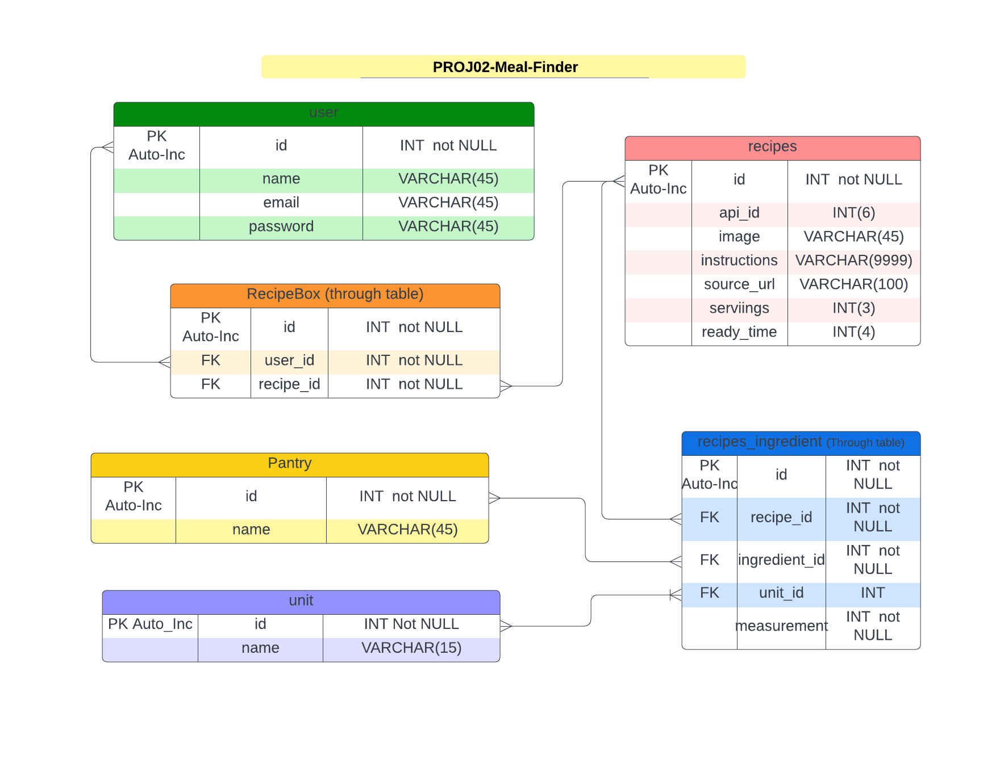

# PROJ02-Meal-Finder
--- Find and Plan your Meal

[](https://opensource.org/licenses/MIT)

## Collaboration

This is a collaboration between Daniel Rasi, Maddrick Long, and Liane Ricciardo.

## Description

Creates a Meal Plan from what a list of ingredients and stores the meal in a session(?)/ favorites in a database(?) 

## Table of Contents
  
- [User Story](#userstory)
- [Acceptance Criteria](#acceptance-criteria)
- [Project Requirements](#project-requirements)
- [Visual Documentation](#visual-documentation)
- [Installation](#installation)
- [Usage](#usage)
- [Credits](#credits)
- [License](#license)
- [Feature](#features)
- [How to Test](#test)


## User Story

```md
AS A home cook
I WANT to find a recipe(s) that I can make from the ingredients I currently have 
I WANT to plan a meal from these ingredients
SO THAT I will use what I have.
```

## Acceptance Criteria

```md
GIVEN a recipe (or entire meal plan)
WHEN I enter a list of ingredients
THEN I get a selection of recipes from which to choose
WHEN I enter option for category
THEN I get a selection of recipes within that category
...


```


## Project Requirements

```md
* Use Node.js and Express.js to create a RESTful API.

* Use Handlebars.js as the template engine.

* Use MySQL and the Sequelize ORM for the database.

* Have both GET and POST routes for retrieving and adding new data.

* Use at least one new library, package, or technology that we haven’t discussed.

* Have a folder structure that meets the MVC paradigm.

* Include authentication (express-session and cookies).

* Protect API keys and sensitive information with environment variables.

* Be deployed using Heroku (with data).

* Have a polished UI.

* Be responsive.

* Be interactive (i.e., accept and respond to user input).

* Meet good-quality coding standards (file structure, naming conventions, follows best practices for class/id naming conventions, indentation, quality comments, etc.).

* Have a professional README (with unique name, description, technologies used, screenshot, and link to deployed application).
```

## Visual Documentation

The following video shows the application being used from the command line:

[](put the HTTPS link here for a video if needed)


## Visual Database Schema

The following is a visual representation of the mealplanner_db database schema.



## Installation

Initialize npm to produce the package.json file.
Type npm install to install the following: MySQL2, sequelize, express, dotenv.
 
In the command line, type npm start.
USES Insomnia to perform CRUD tasks


## Usage
- JavaScript with Node.js - base coding language
- express - to create the routers/endpoints
- dotenv - to hide the environmental variables (password/database)
- MySQL2 package - as the database dialect
- sequelize - to interpret the SQL commands
- handlebarjs - to handle the HTML interface
- Insomnia app - to perform the CRUD functions to the database 

## Credits


## License

This application is using the The MIT License License. Click on the badge  [](https://opensource.org/licenses/MIT)  to follow the link to the license.

---

## Features

Modular routes, MySQL2


## Tests

